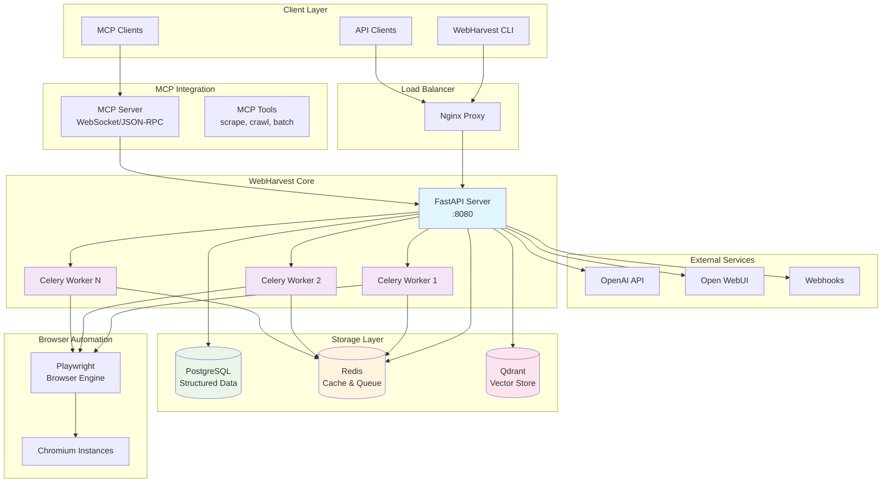
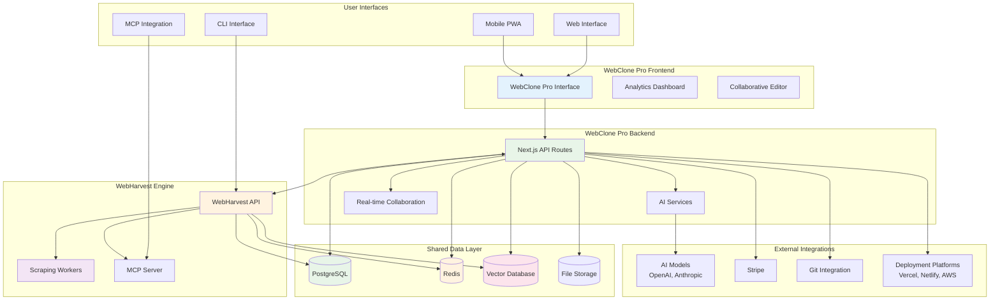
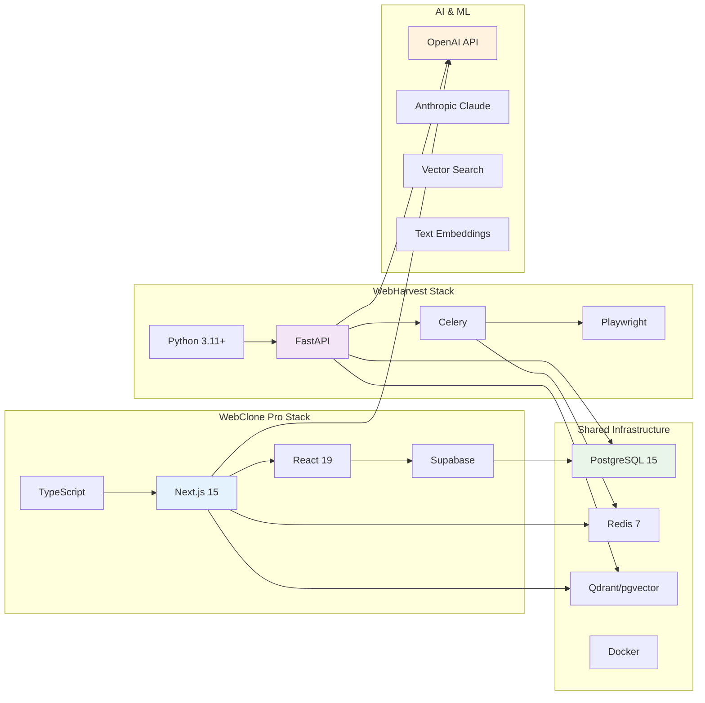

# System Overview Diagrams

This document provides high-level architectural diagrams for the WebHarvest and WebClone Pro ecosystem.

## 1. WebHarvest System Architecture

WebHarvest is a self-hosted web scraping platform built with FastAPI and Celery workers, designed for high-performance data extraction and AI integration.

## 2. WebClone Pro System Architecture

WebClone Pro is an AI-native website cloning platform built with Next.js 15 and Supabase, featuring real-time collaboration and advanced AI capabilities.

```mermaid
graph TB
    subgraph "External Services"
        OPENAI[OpenAI GPT-4]
        STRIPE[Stripe Payments]
        GITHUB[GitHub Integration]
        CDN[CDN/Asset Storage]
    end

    subgraph "Frontend Layer"
        WEB[Next.js 15 Frontend<br/>React 19 + TypeScript]
        CHROME_EXT[Chrome Extension]
        PWA[Progressive Web App]
    end

    subgraph "API Layer"
        NEXTAPI[Next.js API Routes<br/>:3000/api/*]
        WEBSOCKET[WebSocket Server<br/>Real-time Sync]
    end

    subgraph "AI Services"
        AI_CLONE[AI Website Cloner]
        AI_OPTIMIZER[AI Cost Optimizer]
        AI_CHAT[AI Chat Assistant]
        AI_PDF[AI PDF Processor]
        DESIGN_DNA[Design DNA Extractor]
    end

    subgraph "Real-time Collaboration"
        LIVEBLOCKS[Liveblocks Integration]
        YJS[Y.js CRDT]
        MONACO[Monaco Editor<br/>Code Collaboration]
    end

    subgraph "Backend Services"
        SUPABASE[Supabase<br/>Auth + Database + Storage]
        POSTGRES[(PostgreSQL<br/>with pgvector)]
        REDIS[(Redis<br/>Cache + Sessions)]
    end

    subgraph "Deployment Platform"
        VERCEL[Vercel Hosting]
        DOCKER[Docker Containers]
        K8S[Kubernetes Clusters]
    end

    WEB --> NEXTAPI
    CHROME_EXT --> NEXTAPI
    PWA --> NEXTAPI
    
    NEXTAPI --> SUPABASE
    NEXTAPI --> REDIS
    NEXTAPI --> OPENAI
    NEXTAPI --> STRIPE
    
    WEBSOCKET --> LIVEBLOCKS
    WEBSOCKET --> YJS
    
    AI_CLONE --> OPENAI
    AI_OPTIMIZER --> OPENAI
    AI_CHAT --> OPENAI
    AI_PDF --> OPENAI
    
    SUPABASE --> POSTGRES
    
    NEXTAPI --> AI_CLONE
    NEXTAPI --> AI_OPTIMIZER
    NEXTAPI --> AI_CHAT
    NEXTAPI --> AI_PDF
    NEXTAPI --> DESIGN_DNA
    
    MONACO --> YJS
    
    NEXTAPI --> CDN
    NEXTAPI --> GITHUB
    
    WEB --> VERCEL
    NEXTAPI --> DOCKER
    DOCKER --> K8S
    
    style WEB fill:#e3f2fd
    style NEXTAPI fill:#e8f5e8
    style SUPABASE fill:#fff3e0
    style AI_CLONE fill:#f3e5f5
    style AI_OPTIMIZER fill:#f3e5f5
    style AI_CHAT fill:#f3e5f5
    style LIVEBLOCKS fill:#fce4ec
```

## 3. Combined Ecosystem Architecture

This diagram shows how WebHarvest and WebClone Pro work together as a comprehensive web intelligence platform.

## 4. Technology Stack Overview

## Key Architectural Principles

### WebHarvest
- **Microservices Architecture**: Separate API and worker services for scalability
- **Event-Driven Processing**: Celery workers handle async scraping tasks
- **MCP Integration**: Model Context Protocol for AI tool integration
- **Vector Storage**: Qdrant for semantic search and AI-powered content analysis

### WebClone Pro
- **JAMstack Architecture**: Static generation with dynamic API routes
- **AI-First Design**: Integrated AI services for intelligent cloning and optimization
- **Real-time Collaboration**: Live editing with conflict resolution
- **Multi-tenant SaaS**: Secure user isolation with row-level security

### Shared Infrastructure
- **Container-First**: Docker containers for consistent deployments
- **Database-Driven**: PostgreSQL as the single source of truth
- **Cache-Optimized**: Redis for performance and session management
- **Vector-Enhanced**: Semantic search and AI-powered features