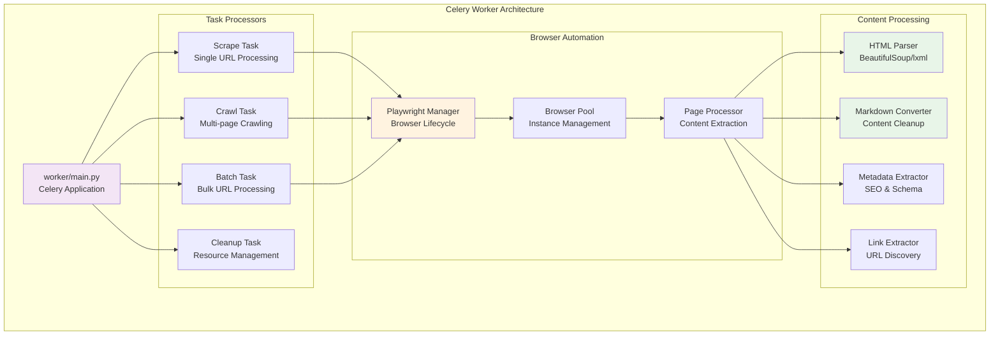
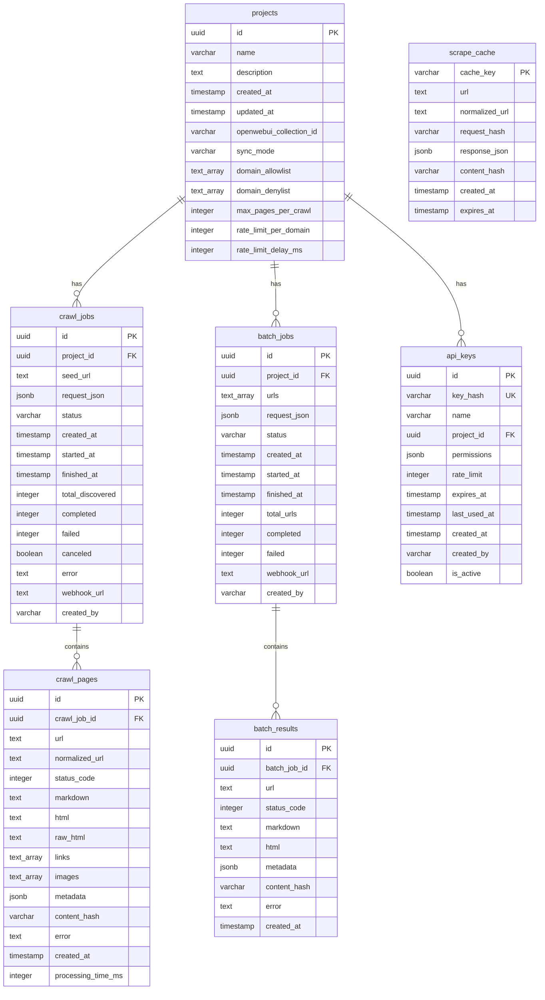
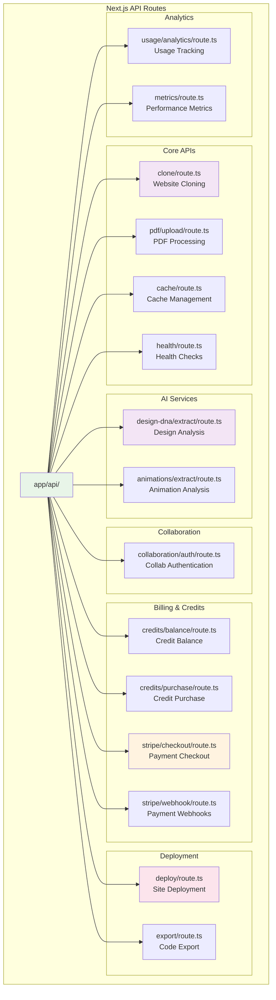
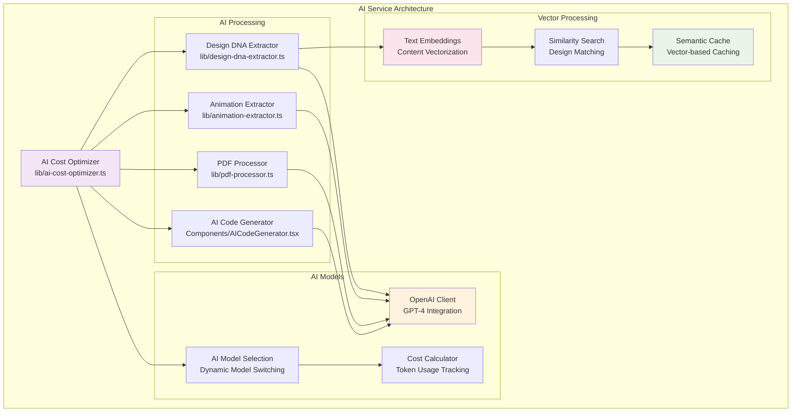
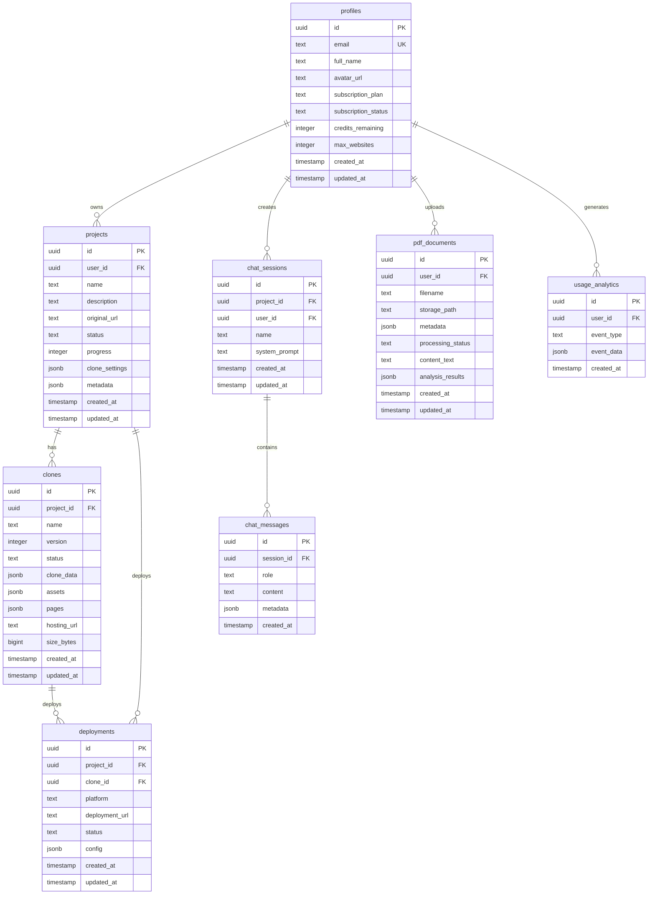
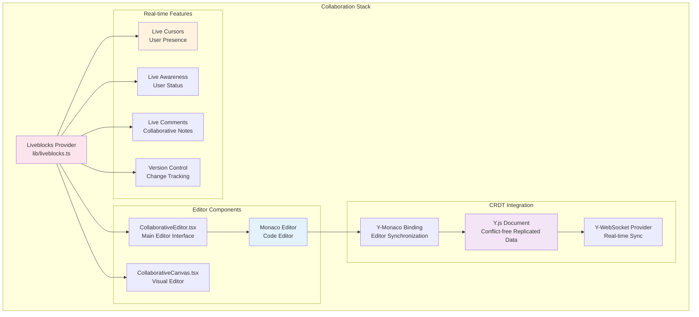
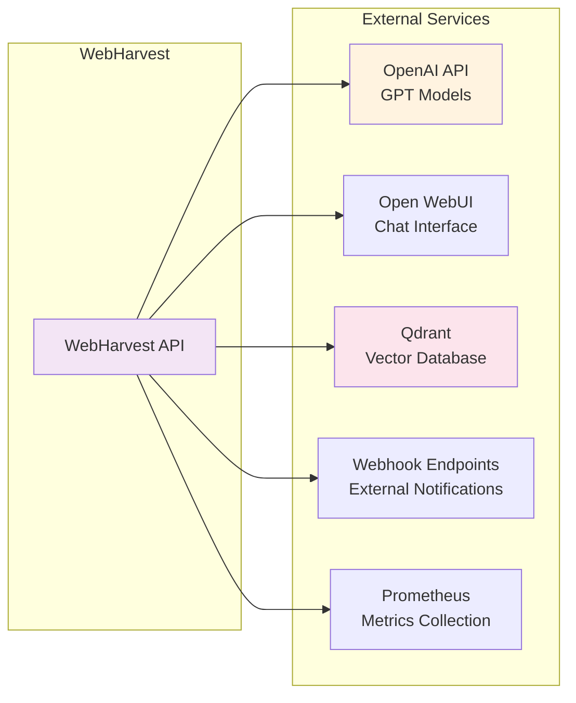
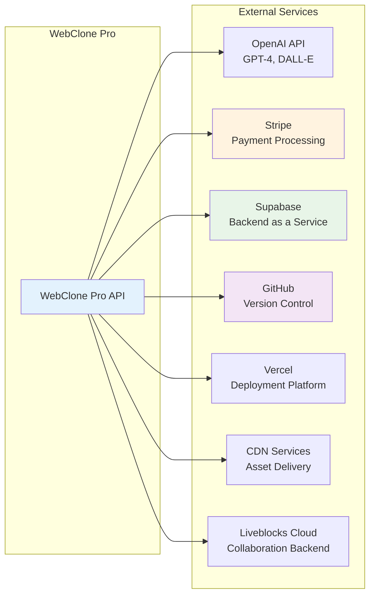

# Component Diagrams

This document provides detailed component-level diagrams for both WebHarvest and WebClone Pro systems.

## 1. WebHarvest Component Architecture

### 1.1 Service Layer Components

```mermaid
graph TB
    subgraph "API Server Components"
        MAIN[main.py<br/>FastAPI Application]
        MIDDLEWARE[Metrics Middleware<br/>CORS & Security]
        
        subgraph "API Routes"
            SCRAPE[/v2/scrape<br/>Single URL Scraping]
            CRAWL[/v2/crawl<br/>Website Crawling]
            BATCH[/v2/batch<br/>Bulk Processing]
            MAP[/v2/map<br/>Site Mapping]
            HEALTH[/healthz<br/>Health Checks]
            METRICS[/metrics<br/>Prometheus]
        end
        
        subgraph "MCP Server"
            MCP_ENHANCED[MCP Enhanced Server<br/>WebSocket/JSON-RPC]
            MCP_TOOLS[MCP Tools<br/>scrape, crawl, batch]
        end
    end

    subgraph "Service Layer"
        SCRAPER_SERVICE[Scraper Service<br/>Content Extraction]
        TASK_MANAGER[Task Manager<br/>Job Orchestration]
        OPENWEBUI_CONNECTOR[OpenWebUI Connector<br/>AI Integration]
    end

    subgraph "Utility Components"
        AUTH[Authentication<br/>API Key Validation]
        LOGGING[Structured Logging<br/>Request Tracking]
        CACHE[Redis Cache<br/>Response Caching]
    end

    MAIN --> MIDDLEWARE
    MIDDLEWARE --> SCRAPE
    MIDDLEWARE --> CRAWL
    MIDDLEWARE --> BATCH
    MIDDLEWARE --> MAP
    MIDDLEWARE --> HEALTH
    MIDDLEWARE --> METRICS

    SCRAPE --> SCRAPER_SERVICE
    CRAWL --> TASK_MANAGER
    BATCH --> TASK_MANAGER
    MAP --> SCRAPER_SERVICE

    MCP_ENHANCED --> MCP_TOOLS
    MCP_TOOLS --> SCRAPER_SERVICE

    SCRAPER_SERVICE --> AUTH
    TASK_MANAGER --> AUTH
    
    SCRAPER_SERVICE --> LOGGING
    TASK_MANAGER --> LOGGING
    
    SCRAPER_SERVICE --> CACHE
    
    style MAIN fill:#e1f5fe
    style SCRAPER_SERVICE fill:#f3e5f5
    style TASK_MANAGER fill:#f3e5f5
    style AUTH fill:#e8f5e8
```

### 1.2 Worker Components



### 1.3 Database Schema Components



## 2. WebClone Pro Component Architecture

### 2.1 Frontend Components

```mermaid
graph TB
    subgraph "Next.js Application Structure"
        APP_ROOT[app/layout.tsx<br/>Root Layout]
        
        subgraph "Page Components"
            LANDING[app/page.tsx<br/>Landing Page]
            DASHBOARD[app/dashboard/page.tsx<br/>Dashboard]
            EDITOR[app/editor/[id]/page.tsx<br/>Project Editor]
            AUTH[app/auth/page.tsx<br/>Authentication]
            PRICING[app/pricing/page.tsx<br/>Pricing]
            ADMIN[app/admin/page.tsx<br/>Admin Panel]
        end
        
        subgraph "UI Components"
            CLONE_PROGRESS[CloneProgress.tsx<br/>Real-time Progress]
            COLLAB_EDITOR[CollaborativeEditor.tsx<br/>Code Editor]
            AI_CHAT[AICodeGenerator.tsx<br/>AI Assistant]
            DEPLOY_DIALOG[DeployDialog.tsx<br/>Deployment UI]
            BILLING[BillingSubscriptionManagement.tsx<br/>Billing UI]
        end
        
        subgraph "3D Components"
            HERO_3D[Hero3D.tsx<br/>Landing Animation]
            THREE_FIBER[React Three Fiber<br/>3D Rendering]
        end
    end

    APP_ROOT --> LANDING
    APP_ROOT --> DASHBOARD
    APP_ROOT --> EDITOR
    APP_ROOT --> AUTH
    APP_ROOT --> PRICING
    APP_ROOT --> ADMIN

    DASHBOARD --> CLONE_PROGRESS
    EDITOR --> COLLAB_EDITOR
    EDITOR --> AI_CHAT
    DASHBOARD --> DEPLOY_DIALOG
    PRICING --> BILLING

    LANDING --> HERO_3D
    HERO_3D --> THREE_FIBER

    style APP_ROOT fill:#e3f2fd
    style COLLAB_EDITOR fill:#f3e5f5
    style AI_CHAT fill:#f3e5f5
    style HERO_3D fill:#fff3e0
```

### 2.2 API Routes Architecture



### 2.3 AI Service Components



### 2.4 Database Schema Components (Supabase)



### 2.5 Real-time Collaboration Components



## 3. External Service Integration Components

### 3.1 WebHarvest External Integrations



### 3.2 WebClone Pro External Integrations



## Component Dependencies and Relationships

### WebHarvest Component Flow
1. **API Layer**: FastAPI routes handle HTTP requests
2. **Service Layer**: Business logic and orchestration
3. **Worker Layer**: Async task processing with Celery
4. **Storage Layer**: PostgreSQL, Redis, and Qdrant
5. **Integration Layer**: MCP server and external APIs

### WebClone Pro Component Flow
1. **Frontend Layer**: Next.js pages and React components
2. **API Layer**: Next.js API routes and middleware
3. **Service Layer**: AI services and business logic
4. **Backend Layer**: Supabase and real-time collaboration
5. **External Layer**: Third-party integrations and deployments

Both systems follow a layered architecture pattern with clear separation of concerns and well-defined interfaces between components.