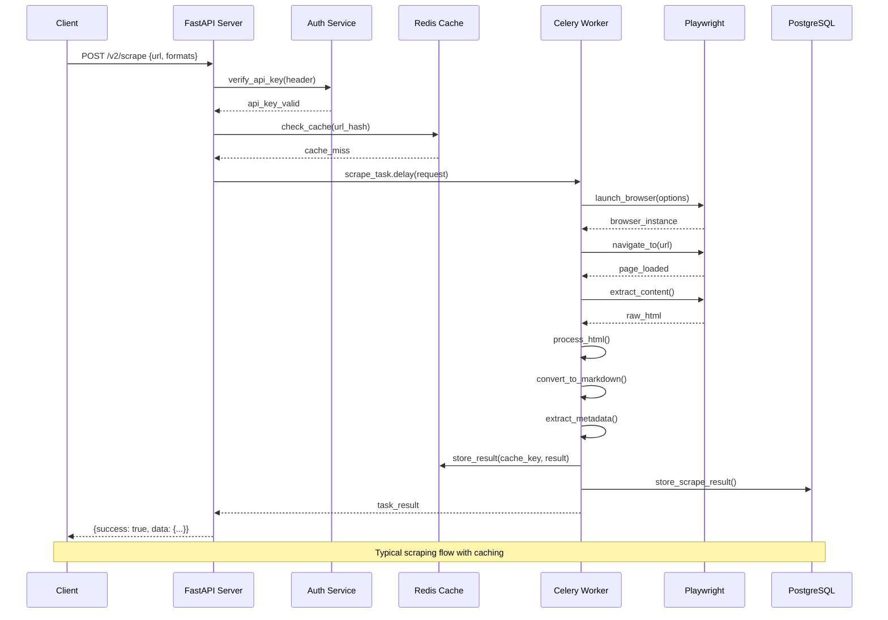
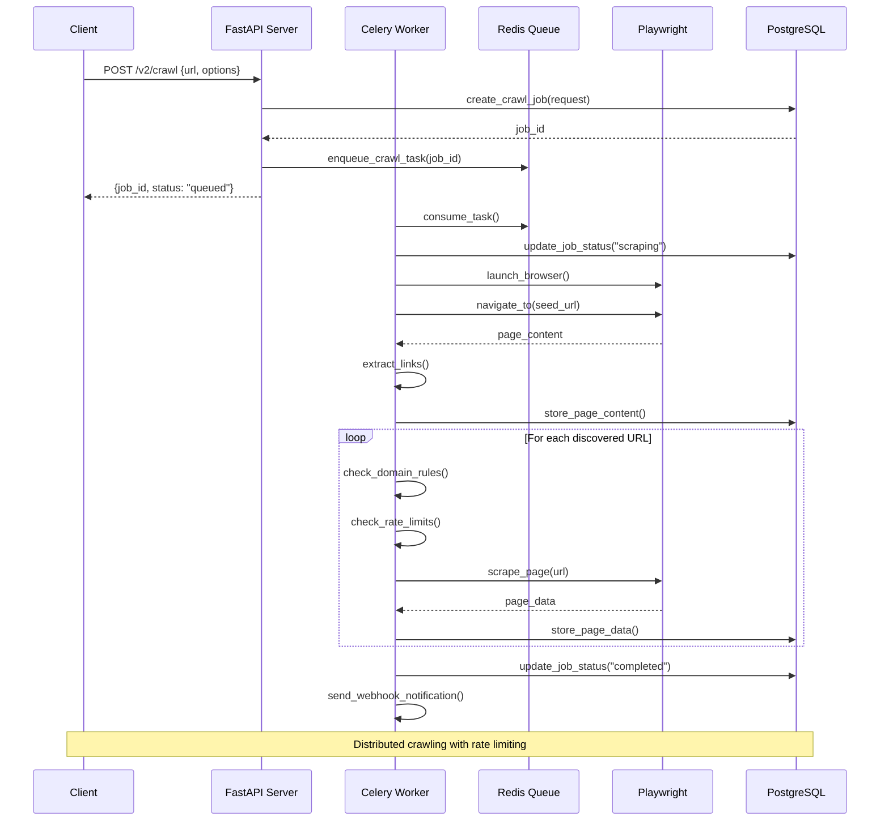
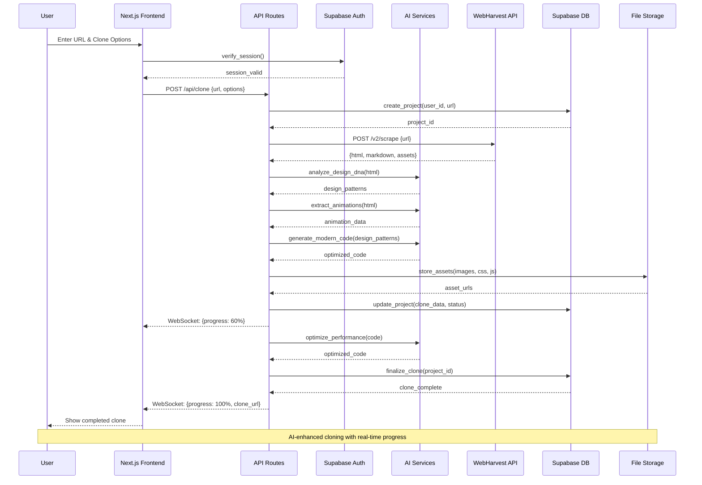
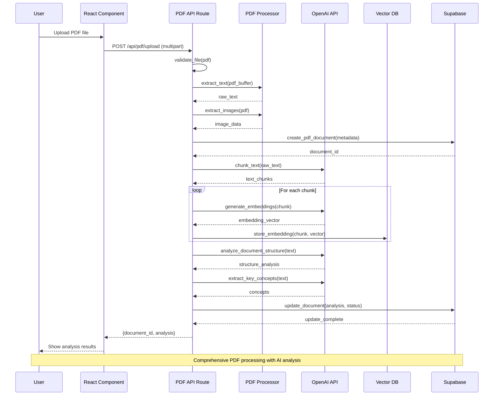
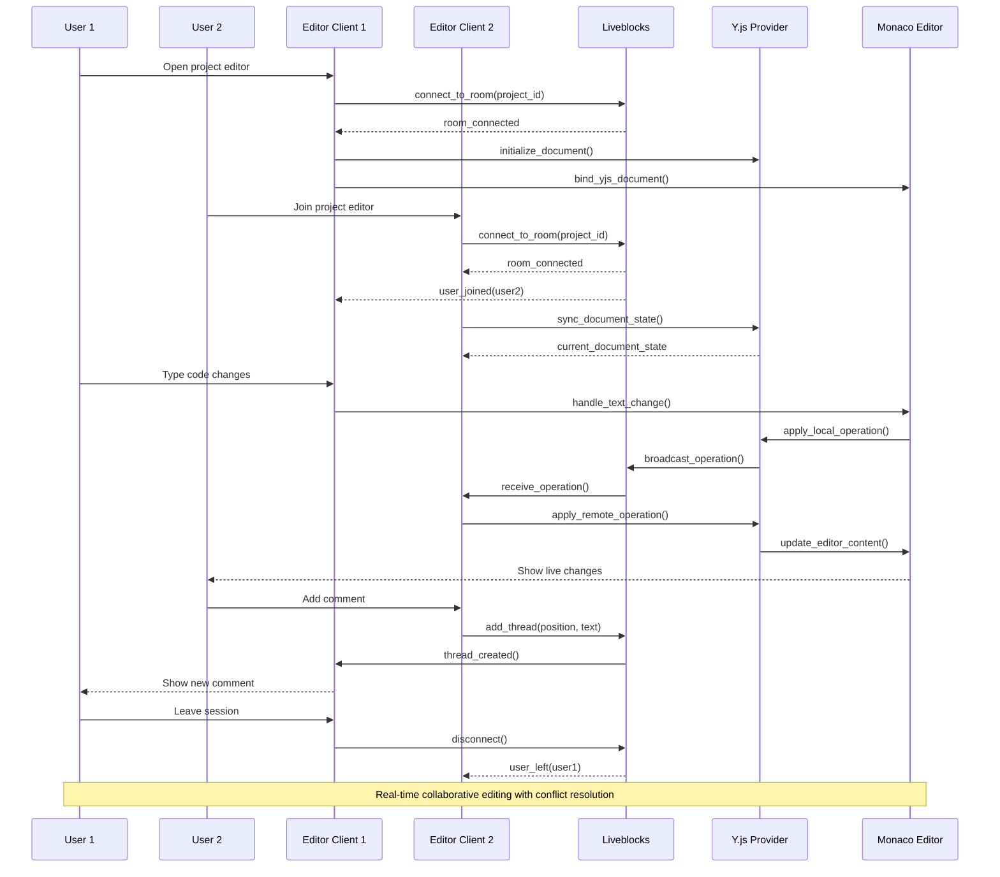
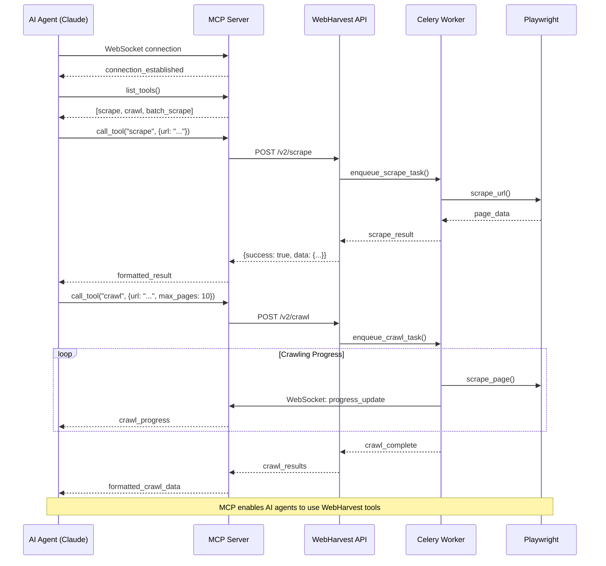
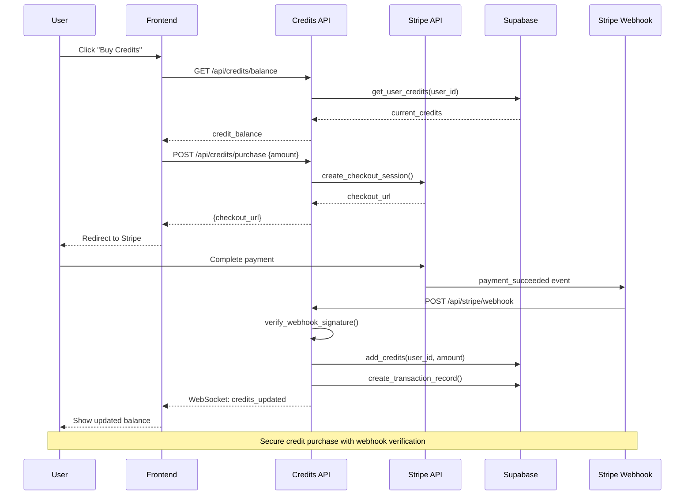
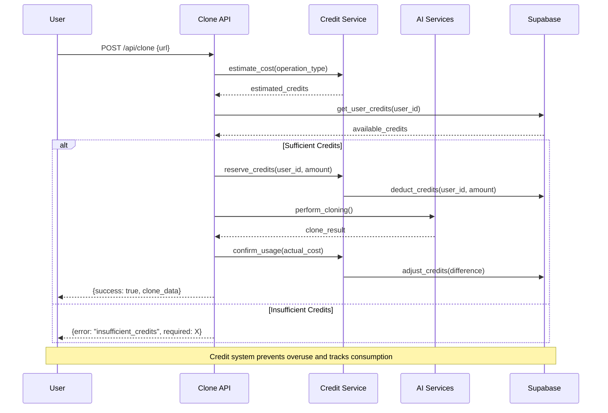
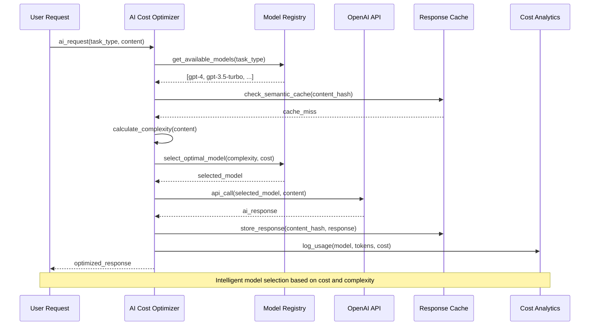
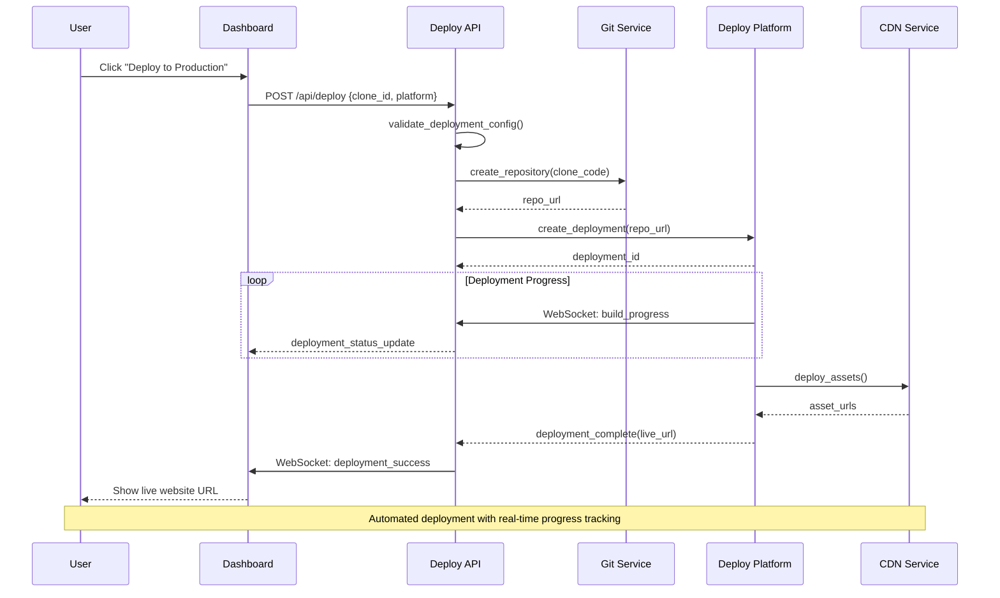

# Sequence Diagrams

This document provides detailed sequence diagrams for the key workflows in WebHarvest and WebClone Pro systems.

## 1. Website Scraping Workflow (WebHarvest)

### 1.1 Single URL Scraping

### 1.2 Website Crawling

## 2. Website Cloning Process (WebClone Pro)

### 2.1 AI-Powered Website Cloning

### 2.2 PDF Processing Pipeline

## 3. Real-time Collaboration Flow

### 3.1 Collaborative Editor Session

## 4. MCP Integration Workflow

### 4.1 MCP Tool Integration

## 5. Credit Tracking and Billing System

### 5.1 Credit Purchase Flow

### 5.2 Credit Deduction Flow

## 6. AI Cost Optimization Flow

### 6.1 Dynamic Model Selection

## 7. Deployment Pipeline Flow

### 7.1 Automated Deployment

## Key Workflow Characteristics

### WebHarvest Workflows
- **Async Processing**: All scraping operations are handled asynchronously
- **Rate Limiting**: Built-in rate limiting prevents overwhelming target sites
- **Caching**: Intelligent caching reduces duplicate requests
- **Error Handling**: Comprehensive error tracking and retry mechanisms

### WebClone Pro Workflows
- **AI-Enhanced**: All major workflows leverage AI for optimization
- **Real-time**: Live collaboration and progress updates
- **Credit-Based**: Cost tracking and usage limitations
- **Multi-Platform**: Support for various deployment targets

### Shared Patterns
- **Event-Driven**: Both systems use event-driven architectures
- **Microservices**: Modular design with clear service boundaries
- **Observability**: Comprehensive logging and metrics collection
- **Security**: Authentication and authorization at every level