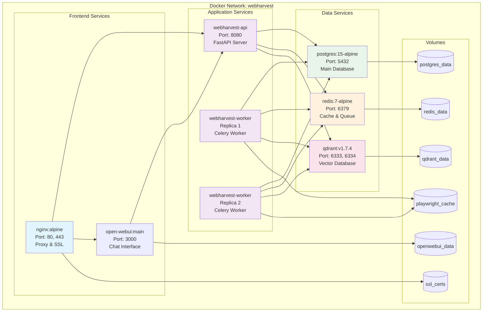
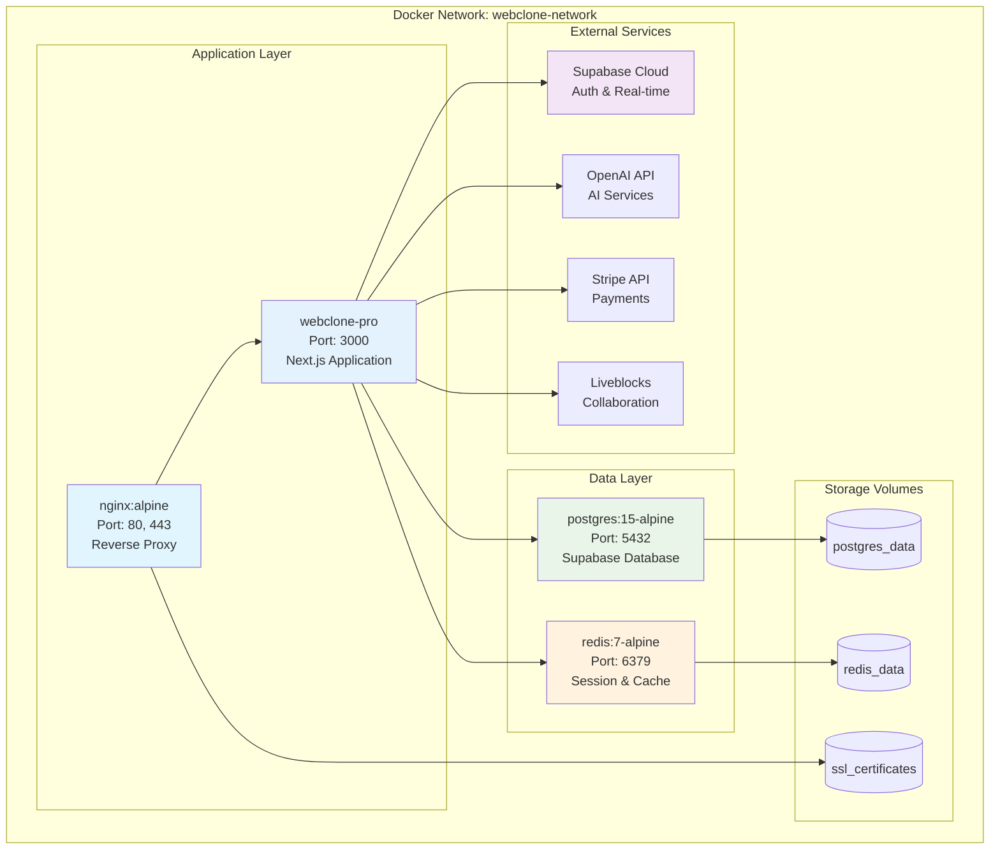
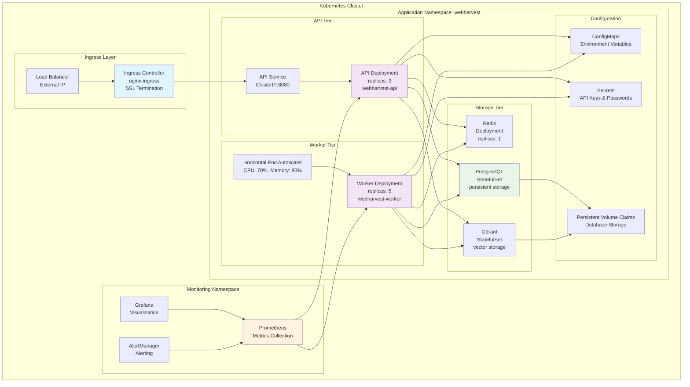
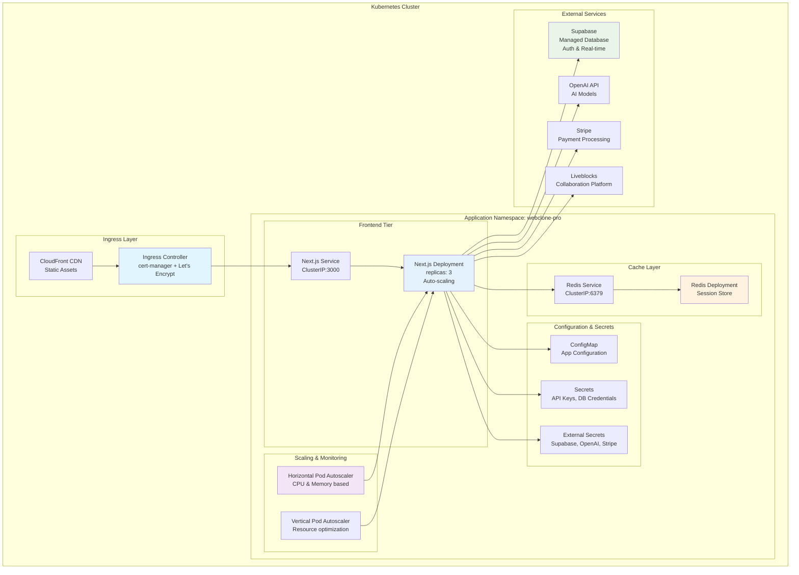
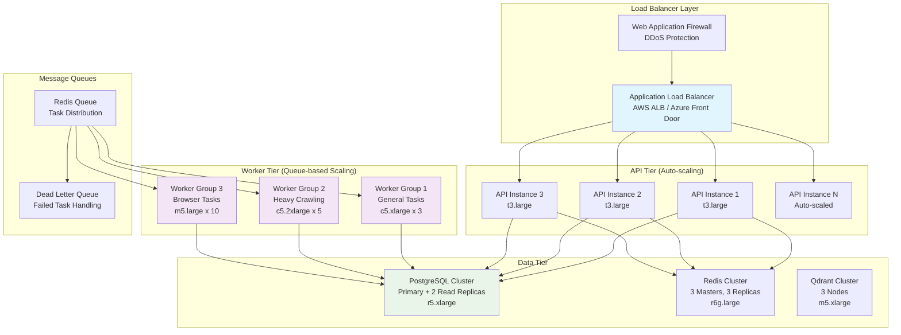
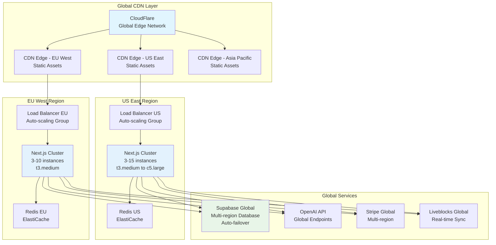
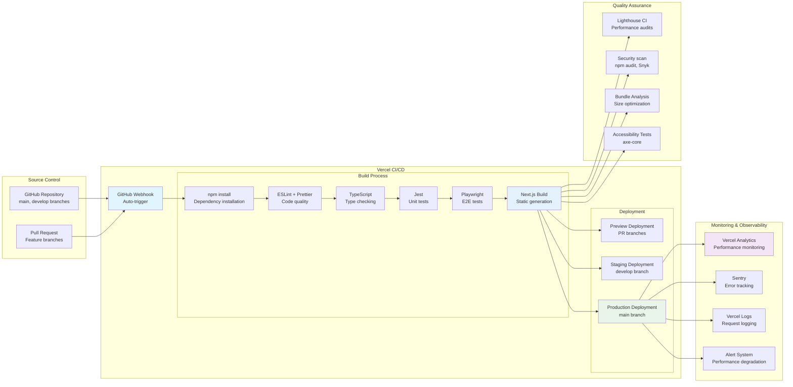
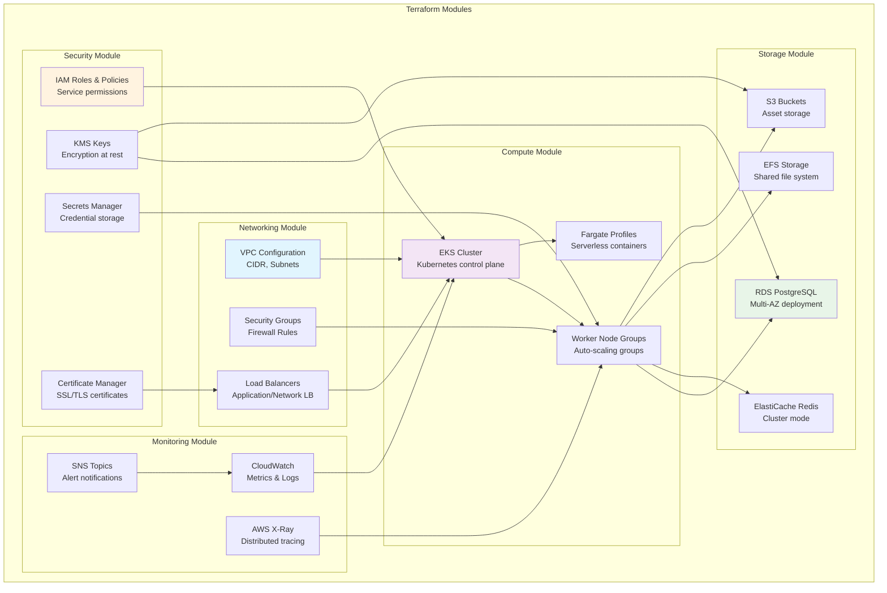

# Deployment Diagrams

This document provides comprehensive deployment architecture diagrams for WebHarvest and WebClone Pro systems across different environments.

## 1. Docker Compose Architecture

### 1.1 WebHarvest Docker Compose Stack

### 1.2 WebClone Pro Docker Compose Stack

## 2. Kubernetes Deployment Architecture

### 2.1 WebHarvest Kubernetes Deployment

### 2.2 WebClone Pro Kubernetes Deployment

## 3. Production Scaling Patterns

### 3.1 WebHarvest Horizontal Scaling

### 3.2 WebClone Pro Global Distribution

## 4. CI/CD Pipeline Visualization

### 4.1 WebHarvest CI/CD Pipeline

```mermaid
graph LR
    subgraph "Source Control"
        GIT[Git Repository<br/>GitHub/GitLab]
        BRANCH[Feature Branch]
        MAIN[Main Branch]
    end

    subgraph "CI Pipeline"
        TRIGGER[Webhook Trigger<br/>Push/PR Events]
        
        subgraph "Build Stage"
            LINT[Code Linting<br/>flake8, black]
            TEST[Unit Tests<br/>pytest]
            SECURITY[Security Scan<br/>bandit, safety]
            BUILD[Docker Build<br/>Multi-stage Build]
        end
        
        subgraph "Quality Gates"
            COVERAGE[Code Coverage<br/>>= 80%]
            SONAR[SonarQube<br/>Quality Analysis]
            VULNS[Vulnerability Scan<br/>Trivy, Snyk]
        end
    end

    subgraph "CD Pipeline"
        subgraph "Staging"
            STAGING_DEPLOY[Deploy to Staging<br/>Kubernetes Staging]
            E2E_TEST[E2E Tests<br/>API Testing]
            PERFORMANCE[Performance Tests<br/>Load Testing]
        end
        
        subgraph "Production"
            APPROVAL[Manual Approval<br/>Release Gate]
            PROD_DEPLOY[Production Deployment<br/>Blue-Green/Canary]
            SMOKE_TEST[Smoke Tests<br/>Health Checks]
            MONITOR[Monitoring<br/>Alerts & Metrics]
        end
    end

    subgraph "Infrastructure"
        TERRAFORM[Terraform<br/>Infrastructure as Code]
        HELM[Helm Charts<br/>Kubernetes Deployments]
        SECRETS[Secret Management<br/>HashiCorp Vault]
    end

    GIT --> TRIGGER
    BRANCH --> TRIGGER
    MAIN --> TRIGGER
    
    TRIGGER --> LINT
    LINT --> TEST
    TEST --> SECURITY
    SECURITY --> BUILD
    
    BUILD --> COVERAGE
    COVERAGE --> SONAR
    SONAR --> VULNS
    
    VULNS --> STAGING_DEPLOY
    STAGING_DEPLOY --> E2E_TEST
    E2E_TEST --> PERFORMANCE
    
    PERFORMANCE --> APPROVAL
    APPROVAL --> PROD_DEPLOY
    PROD_DEPLOY --> SMOKE_TEST
    SMOKE_TEST --> MONITOR
    
    TERRAFORM --> STAGING_DEPLOY
    TERRAFORM --> PROD_DEPLOY
    HELM --> STAGING_DEPLOY
    HELM --> PROD_DEPLOY
    SECRETS --> STAGING_DEPLOY
    SECRETS --> PROD_DEPLOY

    style TRIGGER fill:#e1f5fe
    style BUILD fill:#f3e5f5
    style STAGING_DEPLOY fill:#fff3e0
    style PROD_DEPLOY fill:#e8f5e8
```

### 4.2 WebClone Pro CI/CD Pipeline

## 5. Infrastructure as Code Structure

### 5.1 Terraform Infrastructure Layout

## Deployment Best Practices

### WebHarvest Deployment
- **Container Security**: Non-root containers, minimal base images
- **Resource Management**: CPU/Memory limits and requests defined
- **High Availability**: Multi-AZ deployment with auto-failover
- **Monitoring**: Comprehensive metrics and alerting

### WebClone Pro Deployment
- **Edge Optimization**: Global CDN with edge caching
- **Serverless Scaling**: Function-based scaling for AI operations
- **Performance**: Bundle optimization and lazy loading
- **Real-time**: WebSocket connection management at scale

### Shared Infrastructure
- **GitOps**: Infrastructure and application configuration as code
- **Zero-Downtime**: Blue-green and canary deployment strategies
- **Disaster Recovery**: Automated backup and restore procedures
- **Cost Optimization**: Resource scheduling and right-sizing