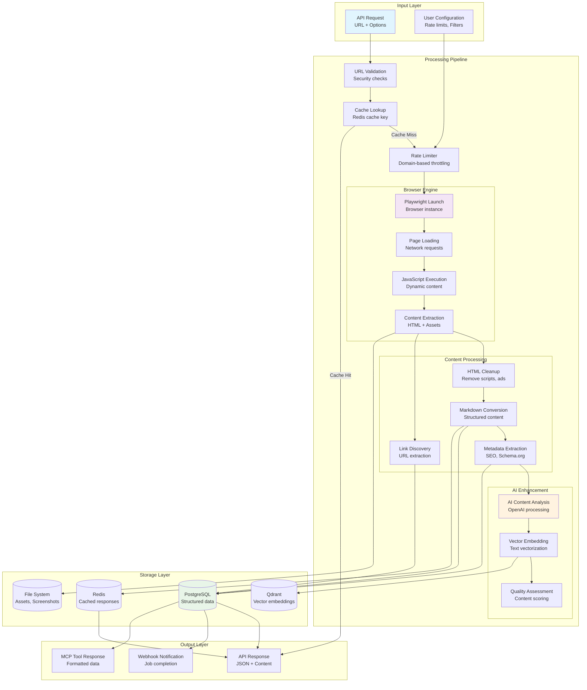
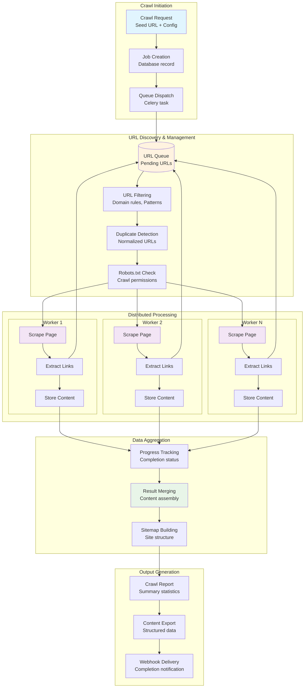
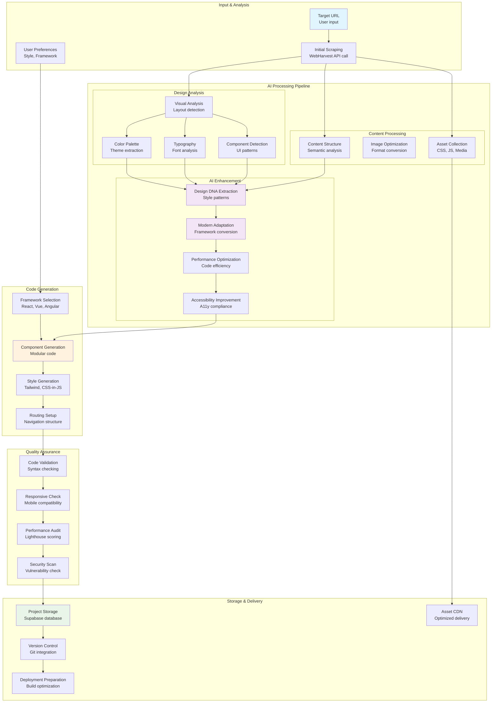
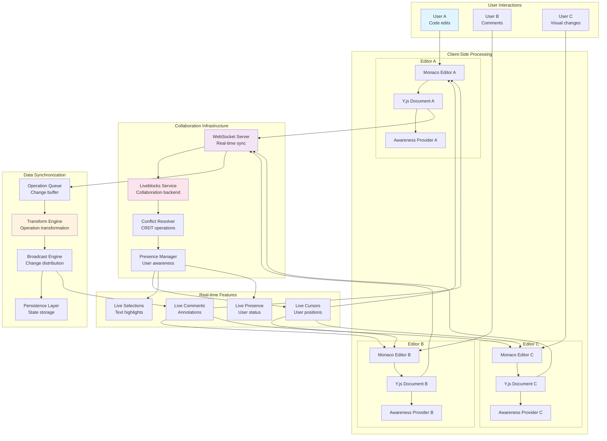
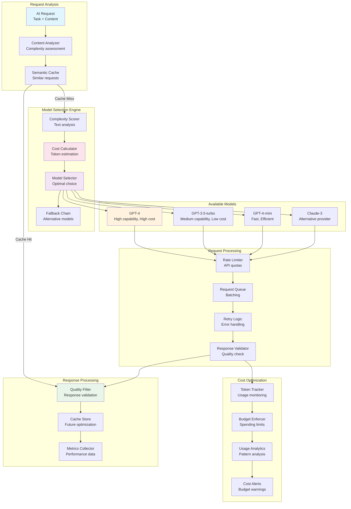
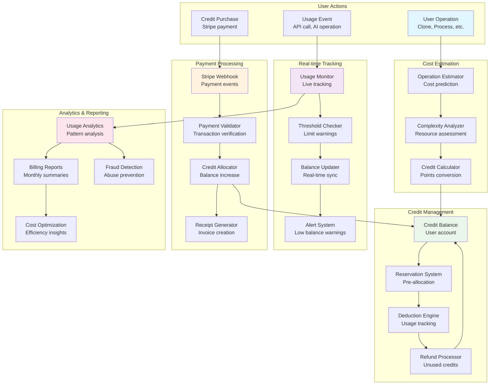
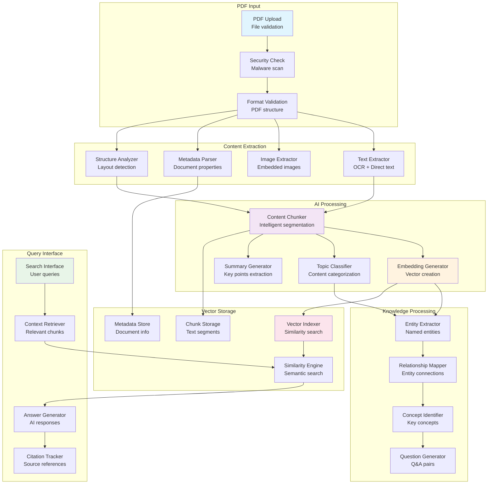

# Data Flow Diagrams

This document provides detailed data flow diagrams for key processes in WebHarvest and WebClone Pro systems.

## 1. WebHarvest Data Flow

### 1.1 Scraping Pipeline Data Flow

### 1.2 Crawling Data Flow

## 2. WebClone Pro Data Flow

### 2.1 AI-Powered Website Cloning Data Flow

### 2.2 Real-time Collaboration Data Flow

## 3. AI Cost Optimization Data Flow

### 3.1 Intelligent Model Selection Flow

## 4. Credit Tracking and Billing Data Flow

### 4.1 Credit Management System

## 5. PDF Processing Data Flow

### 5.1 Intelligent PDF Analysis Pipeline

## Data Flow Characteristics

### WebHarvest Data Patterns
- **Stream Processing**: Continuous data flow through pipeline stages
- **Caching Strategy**: Multi-level caching for performance optimization
- **Parallel Processing**: Worker-based distributed data processing
- **Vector Integration**: Semantic search capabilities with embeddings

### WebClone Pro Data Patterns
- **AI-Driven Pipeline**: Multiple AI services in processing chain
- **Real-time Synchronization**: Live collaboration data streams
- **Cost Optimization**: Data flow designed for efficient resource usage
- **Multi-format Output**: Support for various deployment targets

### Shared Data Principles
- **Data Validation**: Input validation at every entry point
- **Error Handling**: Graceful degradation with fallback mechanisms
- **Monitoring**: Comprehensive data flow observability
- **Security**: Data protection throughout the processing pipeline