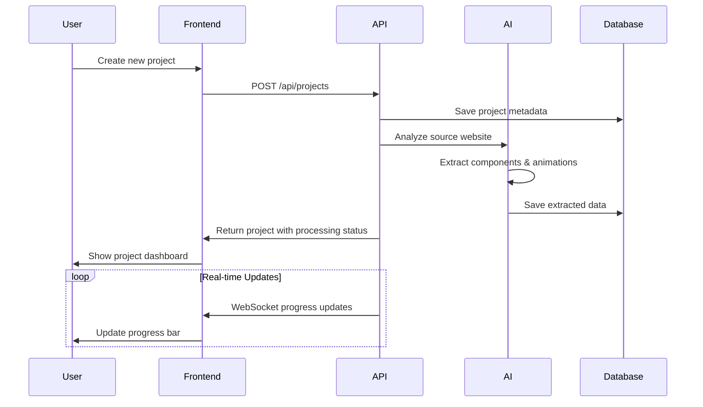
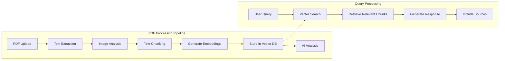
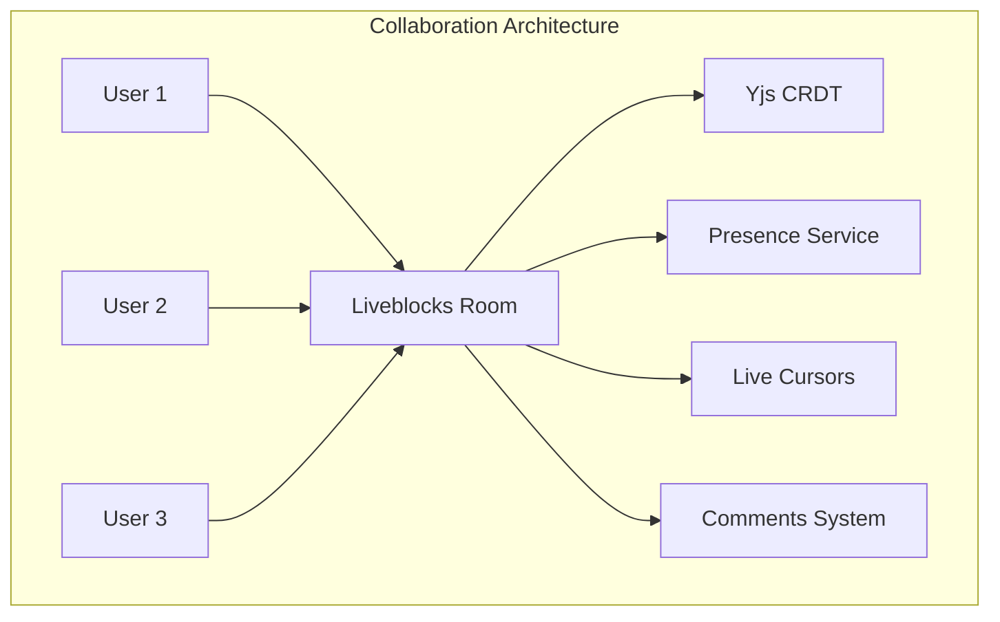
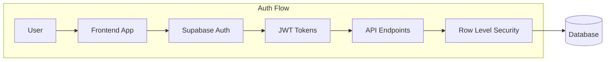
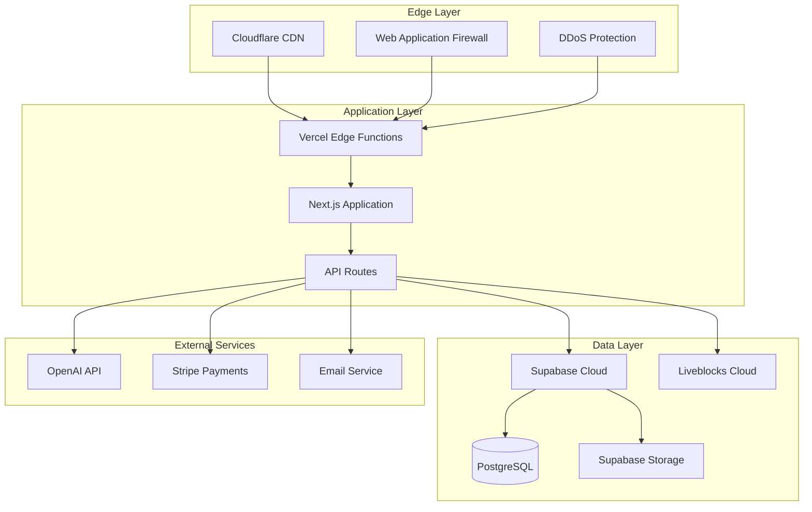

# WebClone Pro 2026 - System Architecture

## Architecture Overview

WebClone Pro 2026 is a next-generation AI-native website cloning and creation platform built with modern cloud-native principles, featuring advanced PDF processing, real-time collaboration, and intelligent cost optimization.

```mermaid
graph TB
    subgraph "Frontend Layer"
        UI[Next.js 15 Frontend]
        Mobile[React Native Mobile]
        PWA[Progressive Web App]
    end
    
    subgraph "API Gateway & Load Balancer"
        Gateway[Next.js API Routes]
        Auth[Supabase Auth]
        RateLimit[Rate Limiting]
        CORS[CORS Handler]
    end
    
    subgraph "Core Services"
        ProjectService[Project Service]
        PDFService[PDF Processing Service]
        AIService[AI Cost Optimizer]
        CollabService[Collaboration Service]
        BillingService[Billing Service]
        AnalyticsService[Analytics Service]
    end
    
    subgraph "AI & Processing"
        OpenAI[OpenAI GPT-4o/GPT-4o-mini]
        Embeddings[Text Embeddings]
        Vision[Vision API]
        BatchAPI[Batch API Processing]
    end
    
    subgraph "Real-time Infrastructure"
        Liveblocks[Liveblocks Collaboration]
        WebSockets[WebSocket Connections]
        Presence[Presence Tracking]
        CRDT[Yjs CRDT]
    end
    
    subgraph "Data Layer"
        Supabase[(Supabase PostgreSQL)]
        SupaStorage[Supabase Storage]
        Vector[pgvector Extensions]
        Cache[Redis Cache]
        CDN[Cloudflare CDN]
    end
    
    subgraph "Payment & Billing"
        Stripe[Stripe Payment Processing]
        Webhooks[Stripe Webhooks]
        Subscriptions[Subscription Management]
    end
    
    subgraph "Monitoring & Analytics"
        Telemetry[OpenTelemetry]
        Logs[Structured Logging]
        Metrics[Performance Metrics]
        Alerts[Error Alerting]
    end
    
    UI --> Gateway
    Mobile --> Gateway
    PWA --> Gateway
    
    Gateway --> Auth
    Gateway --> RateLimit
    Gateway --> CORS
    Gateway --> ProjectService
    Gateway --> PDFService
    Gateway --> CollabService
    Gateway --> BillingService
    Gateway --> AnalyticsService
    
    ProjectService --> OpenAI
    PDFService --> OpenAI
    PDFService --> Embeddings
    PDFService --> Vision
    AIService --> BatchAPI
    
    CollabService --> Liveblocks
    CollabService --> WebSockets
    Liveblocks --> Presence
    Liveblocks --> CRDT
    
    ProjectService --> Supabase
    PDFService --> Supabase
    PDFService --> SupaStorage
    PDFService --> Vector
    BillingService --> Stripe
    BillingService --> Webhooks
    
    AIService --> Cache
    AnalyticsService --> Supabase
    
    Gateway --> Telemetry
    Gateway --> Logs
    Gateway --> Metrics
    
    UI --> CDN
```



## Technology Stack

### Frontend
- **Framework**: Next.js 15 with App Router
- **UI Library**: React 19 with TypeScript
- **Styling**: Tailwind CSS + shadcn/ui components
- **Animation**: Framer Motion
- **State Management**: React Context + Zustand
- **Real-time**: Liveblocks + Yjs CRDT

### Backend
- **Runtime**: Node.js 18+ with TypeScript
- **API Framework**: Next.js API Routes
- **Database**: Supabase (PostgreSQL 15+)
- **Vector Database**: pgvector extension
- **File Storage**: Supabase Storage
- **Authentication**: Supabase Auth with Row Level Security

### AI & Processing
- **Primary AI**: OpenAI GPT-4o-mini (cost-optimized)
- **Advanced AI**: OpenAI GPT-4o (complex tasks)
- **Embeddings**: text-embedding-3-small
- **Vision**: GPT-4o Vision API
- **Cost Optimization**: Custom AICostOptimizer class

### Infrastructure
- **Hosting**: Vercel (Frontend) + Supabase (Backend)
- **CDN**: Cloudflare
- **Monitoring**: OpenTelemetry + Vercel Analytics
- **Payments**: Stripe with webhook processing
- **Email**: Resend for transactional emails

## Core Components

### 1. Project Management System

The project management system handles website cloning projects with AI-powered analysis and component extraction.



**Key Features**:
- AI-powered website analysis and component extraction
- Support for 20+ target frameworks (React, Vue, Angular, etc.)
- Animation extraction and conversion
- Real-time processing progress
- Version control and history

### 2. PDF Intelligence & RAG System

Advanced PDF processing with AI-powered analysis and semantic search capabilities.



**Key Features**:
- Multi-format document support (PDF, images, text)
- AI-powered content analysis and summarization
- Semantic search with pgvector
- Source attribution and relevance scoring
- Cost-optimized model selection

### 3. AI Cost Optimization Engine

Intelligent AI usage optimization to maximize profitability while maintaining quality.

```typescript
// Cost Optimization Flow
class AICostOptimizer {
  selectOptimalModel(task: string, complexity: 'simple' | 'medium' | 'complex'): string {
    // 80% of tasks use GPT-4o-mini (8x cheaper)
    // 15% use GPT-4o for complex tasks
    // 5% use GPT-4-turbo for specialized tasks
  }
  
  calculateCost(model: string, inputTokens: number, outputTokens: number): number {
    // Real-time cost calculation with caching discounts
  }
  
  convertToCredits(cost: number, userTier: string): number {
    // 6-8x markup for 75-83% profit margins
  }
}
```

**Cost Optimization Strategies**:
- Smart model routing based on task complexity
- Batch API processing for 50% cost reduction
- Prompt caching for system prompts
- Usage analytics and optimization recommendations
- Tiered pricing with healthy profit margins

### 4. Real-time Collaboration

Multi-user real-time collaboration with conflict resolution and presence awareness.



**Features**:
- Real-time code editing with Monaco Editor
- Live cursors and user presence
- Conflict-free collaborative editing (CRDT)
- Comment and annotation system
- Permission-based access control

## Data Architecture

### Database Schema

```sql
-- Core Tables
CREATE TABLE profiles (
    id UUID PRIMARY KEY REFERENCES auth.users(id),
    email TEXT UNIQUE NOT NULL,
    full_name TEXT,
    avatar_url TEXT,
    subscription_tier TEXT DEFAULT 'starter',
    credits_balance INTEGER DEFAULT 0,
    created_at TIMESTAMPTZ DEFAULT NOW()
);

CREATE TABLE projects (
    id UUID PRIMARY KEY DEFAULT gen_random_uuid(),
    user_id UUID NOT NULL REFERENCES profiles(id),
    name TEXT NOT NULL,
    source_url TEXT,
    status TEXT DEFAULT 'processing',
    framework TEXT DEFAULT 'react',
    metadata JSONB DEFAULT '{}',
    created_at TIMESTAMPTZ DEFAULT NOW()
);

CREATE TABLE pdf_documents (
    id UUID PRIMARY KEY DEFAULT gen_random_uuid(),
    user_id UUID NOT NULL REFERENCES profiles(id),
    filename TEXT NOT NULL,
    file_path TEXT NOT NULL,
    status TEXT DEFAULT 'uploading',
    metadata JSONB DEFAULT '{}',
    processing_result JSONB,
    created_at TIMESTAMPTZ DEFAULT NOW()
);

-- Vector embeddings for semantic search
CREATE TABLE document_embeddings (
    id UUID PRIMARY KEY DEFAULT gen_random_uuid(),
    document_id UUID NOT NULL REFERENCES pdf_documents(id),
    content TEXT NOT NULL,
    embedding vector(1536),  -- OpenAI embedding size
    metadata JSONB DEFAULT '{}'
);

-- Usage analytics for cost optimization
CREATE TABLE usage_analytics (
    id UUID PRIMARY KEY DEFAULT gen_random_uuid(),
    user_id UUID NOT NULL REFERENCES profiles(id),
    feature TEXT NOT NULL,
    tokens_used INTEGER DEFAULT 0,
    cost DECIMAL(10, 6) DEFAULT 0,
    credits_used INTEGER DEFAULT 0,
    metadata JSONB DEFAULT '{}',
    created_at TIMESTAMPTZ DEFAULT NOW()
);

-- Indexes for performance
CREATE INDEX idx_embeddings_vector ON document_embeddings USING ivfflat (embedding vector_cosine_ops);
CREATE INDEX idx_analytics_user_date ON usage_analytics(user_id, created_at);
```

### Data Flow

1. **User Data**: Stored in Supabase with Row Level Security
2. **File Storage**: Supabase Storage with automatic CDN
3. **Vector Search**: pgvector for semantic similarity
4. **Analytics**: Time-series data for usage tracking
5. **Cache**: Redis for session and API response caching

## Security Architecture

### Authentication & Authorization



**Security Features**:
- JWT-based authentication with automatic refresh
- Row Level Security (RLS) for multi-tenant data isolation
- API rate limiting by user tier
- CORS protection and CSP headers
- Input validation and sanitization
- Secure file upload with virus scanning

### Data Protection

- **Encryption**: All data encrypted at rest and in transit
- **Backup**: Automated daily backups with point-in-time recovery
- **Compliance**: GDPR and SOC 2 compliance through Supabase
- **Monitoring**: Real-time security event monitoring
- **Access Control**: Role-based access with audit logging

## Performance & Scalability

### Optimization Strategies

1. **Frontend Performance**:
   - Next.js Static Site Generation (SSG)
   - Automatic code splitting and tree shaking
   - Image optimization with Next.js Image
   - Edge caching with Cloudflare

2. **API Performance**:
   - PostgreSQL query optimization with indexes
   - Redis caching for frequently accessed data
   - Connection pooling for database efficiency
   - Background job processing for heavy tasks

3. **AI Cost Optimization**:
   - Smart model selection (80% GPT-4o-mini usage)
   - Batch API processing for non-urgent tasks
   - Prompt caching for system messages
   - Usage-based scaling and monitoring

### Scalability Considerations

- **Horizontal Scaling**: Vercel serverless functions auto-scale
- **Database**: Supabase handles connection pooling and read replicas
- **File Storage**: Automatic CDN with global distribution
- **Real-time**: Liveblocks handles WebSocket scaling
- **Monitoring**: OpenTelemetry for distributed tracing

## Deployment Architecture

### Production Environment



**Deployment Features**:
- **Zero-downtime deployments** with Vercel
- **Edge computing** for global performance
- **Automatic scaling** based on traffic
- **Health checks** and monitoring
- **Rollback capabilities** for quick recovery

This architecture provides a robust, scalable, and cost-effective foundation for WebClone Pro 2026, optimized for AI workloads and real-time collaboration while maintaining high performance and security standards.